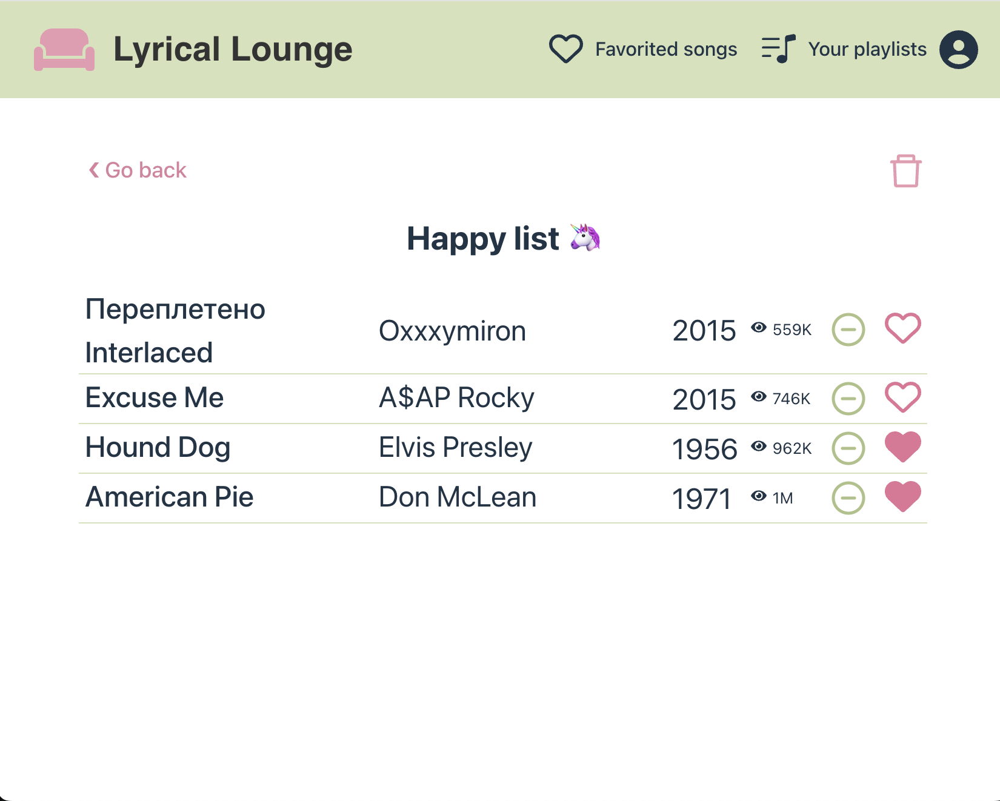

# Lyrical Lounge

## Link to Project on VM

http://it2810-12.idi.ntnu.no/project2/  
Our project is available on the link above, as long as you are connected to the NTNU Wi-Fi or VPN from NTNU. As the backend is running with PM2 on the virtual machine, there is no need to restart the backend each time.

## Table of Contents

- [About the Project](#about-the-project)
  - [Features](#features)
  - [Technology](#technology)
- [Running the Project](#running-the-project)
  - [Run Project](#run-project)
  - [Run ESLint and Prettier](#run-eslint-and-prettier)
  - [Run Tests](#run-tests)
- [Database](#database)
  - [The Dataset](#the-dataset)
- [Web Accessibility](#web-accessibility)
- [Sustainable Web Development](#sustainable-web-development)

## About the Project

Lyrical Lounge is an application where you can discover new songs and read their lyrics. The songs are displayed in a list, and you can click each song to read the lyrics and find more information about it.

The main functionality of the application is creating a user, viewing individual songs witht their lyrics, saving your favorites, and creating playlists. On the homepage, users can search for songs, filter by genre and number of views, and sort by title, artist, or views.

We’ve focused on sustainability with features like dark mode, efficient data fetching, and caching to save energy. Also, we’ve made the app more accessible with features such as labels and keyboard navigation.

  
  
  
  

### Features

- **Create User**: You can create a user with a unique username to automatically sync your playlists and favorites to it.
  - **NOTE**: You are required to create a user to use the functionality such as favoriting and making playlists, but you can explore most of the mainpage without creating a user.
- **View Songs**: Clicking on a song from the list takes you to a detailed page with lyrics and more information.
- **Filter, Sort, and Search**: Use the filter menu on the homepage to filter songs by genre or views. You can also sort the list by title, artist, or views. The search field allows you to find songs by typing the song's title or artist name.
- **Navigation**: You can navigate between the pages: "Home", "Favorited Songs", and "Your Playlists" to see different features.
- **Create Playlists**: Create your own playlists on the "Your Playlists" page using the "New Playlist" button. Songs can be added to playlists from either the homepage or favorite song-page, and they can also be removed from the playlist. Playlists can also be deleted.
- **Favorite Songs**: Mark your favorite songs by clicking the heart icon next to them. These favorited songs appear on the "Favorited Songs" page.

### Technology

We have used the GRAND stack, with the technology GraphQL, React with TypeScript, Apollo and Neo4j Database. CSS and HTML is also used in frontend. Prettier and ESLint is used to maintain code quality.

For state management we have chosen to use Apollo Local State Management, as this integrated well with our tech-stack. We used Apollo's reactive variables to handle states in for example filters, sorting, search terms, favorite songs, and playlists directly on the client side. By syncing these variables with sessionStorage and localStorage, we made sure user settings are saved even when you refresh the page.

We have written component-tests, E2E-tests and API-tests. To do this, we have used the testing tools Vitest and Cypress. Further information about the tests can be found [here](prosjekt2/backend/e2e/README.md).

## Running the Project

### Run Project

If you want to install the project from your computer, clone the project using git clone https://git.ntnu.no/IT2810-H24/T12-Project-2.git, and then write the following in the terminal to start the frontend:

`cd prosjekt2/frontend`  
`npm install`  
`npm run dev`

The backend is running on the virtual machine, so you need to be connected to NTNU network or VPN.

### Run ESLint and Prettier

ESLint and Prettier is used to ensure good quality of the code. Prettier is used in the whole application. From the root of the project you can run `npx prettier --check .` to ensure everything is up to standards. ESLint can be ran in the frontend of the project. Navigate into the folder using `cd prosjekt2/frontend` and run the command `npm run lint`.

**NOTE**: When running ESLint, there is a warning on the version of typescript. We have chosen to ignore this warning for now, as we don't want to downgrade the typescript version just to get rid of the warning on ESLint.

### Run Tests

The component-tests are ran by navigating into the frontend folder, using `cd prosjekt2/frontend` and run tests with `npm test`.

Since both regular E2E-tests and API-tests are implemented using Cypress, they can be ran the same way.
In order for them to work, both backend and frontend have to be ran locally, because they run the tests on localhost.

First, you need to run both frontend and backend. Open one terminal and run:  
`cd prosjekt2/frontend`  
`npm install`  
`npm run dev`

And then open a new terminal and run:  
`cd prosjekt2/backend`  
`npm install`  
`cd e2e`  
`npm install`  
`cd ..`  
`npx ts-node src/index.ts`

Now you are ready to run the tests! Open a new terminal, navigate into the correct folder by using `cd prosjekt2/backend/e2e` and then `npx cypress open`. A popupwindow will show up. Here you should choose **E2E Testing** and then **Start E2E Testing in Chrome**. From here you can choose which tests (”specs”) to run. The tests inside the folder called api are the API-tests, and the rest are regular E2E-tests. Read more on the tests [here](prosjekt2/backend/e2e/README.md).  
**NOTE**: In some cases, the tests don't work due it not finding the localhost. If this happens, close all terminals and restart the process. If the network-connection is slow, you might have to wait a bit to open the tests after you open the frontend and backend.

## Database

As we have chosen the GRAND stack, we are using the Neo4j as database. From the beginning, as we imported our dataset, we had the following labels and relations

- **Artist**
- **Song**
- **Genre**
- **PERFORMED_BY** (connects a Song to an Artist)
- **HAS_GENRE** (connects a Song to a Genre)

As we have implemented users, favorites and playlists in our application, the database was expanded with the new labels and relations

- **User**
- **Playlist**
- **CONTAINS** (connects a Playlist to a Song)
- **OWNS** (connects a User to a Playlist)
- **HAS_FAVORITES** (connects a User to a Song)

Altogether our database contains 5 656 nodes and 5 955 relationships (at the moment).

### The Dataset

The dataset we have chosen is from Genius via Kaggle ([Kaggle: Genius Song Lyrics](https://www.kaggle.com/datasets/carlosgdcj/genius-song-lyrics-with-language-information/data?fbclid=IwY2xjawGmhStleHRuA2FlbQIxMAABHUqHd8QJKNwFXvGOQBCHINMiJyj2AavdahQAgUNSbD4UYXtmF86PlzyjSg_aem_J3KYHhgyLC8fxWh4w4b1XA)), and after some manipulation it includes 24 753 songs. The information on each song is title, artist, genre, year, views (how many times someone have looked it up on genius) and songlyrics. We have also added an id for each song. As the database on the virtual machine had limited space, it is 2 947 songs in the application right now. If we could start over with choosing the songs, we would have made sure to pick songs with an even distribution of views and genres, and maybe filter out songs from artists like “Genius English Translations” and such.

## Web Accessibility

We've put a lot of effort into making the site accessible for everyone. All icons and non-text elements have labels, so screen readers can easily understand what they are. We've also added ARIA labels to improve navigation for assistive technologies. Plus, the entire site is fully navigable using just the keyboard, so you don’t need a mouse to get around. This way, we make sure everyone can use our site comfortably. We have also tried to take into account which colors to use, to make sure the contrast sufficient, in order to make the content accessible for people with visual impairments.

## Sustainable Web Development

We've tried to make our project more sustainable by keeping things simple and efficient. To avoid making unecessary calls to the backend, the search field only works when you press Enter, and the views-filter fetches songs when you let go of the “thumbs” (instead of continously fetching). Caching is also used to speed things up and reduce server load. We’ve added dark mode and light mode that follow your system settings automatically to help save energy, and we’ve kept the design minimal by not using many images or animations and sticking mostly to neutral colors with lots of white space. This helps keep the site fast and light while being easier on energy use. For the loading of songs, we have chosen to load 30 at a time and have implemented dynamic loading with a "Load more songs" button at the bottom of the list. This approach is more sustainable than loading everything at once, as it saves bandwidth and reduces energy consumption by only loading data when needed. It also improves performance by speeding up initial load times and reducing memory usage, which ensures a smoother user experience.
